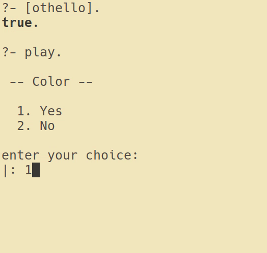

# Othello Prolog

> A fully functional [Othello game](https://en.wikipedia.org/wiki/Reversi), made for the [swi prolog interpreter](http://www.swi-prolog.org/)

<p align="center">
  <a href="https://github.com/Drakirus/othello-prolog/blob/master/demo.gif">
    
  </a>
</p>

## Overview

This app allows 2 players to play an Othello game.

> During de pre-game menu the admin can set the 2 players to be ether a human or
> a AIs
>
>
> `-- Set the Player x to be a --`  
>  `1. Human`  
>  `2. Bot (random)   `    ---> A totally random AI. [random.pl](./ai/random.pl)  
>  `3. Bot (minmax)   `    ---> An AI using the min-max algorithm. [minmax.pl](./ai/minmax.pl)  
>  `4. Bot (alphabeta)` ---> An AI using the alpha-beta algorithm. [alphabeta.pl](./ai/alphabeta.pl)

## Usages

### Play using the console
Load the file in the swipl-interpreter:
```
$ swipl ./othello.pl
```
Play the game:
```
>?- play.
```

## Things about this implementation

### Heuristic/Evaluation Function 

I used [this](https://courses.cs.washington.edu/courses/cse573/04au/Project/mini1/RUSSIA/Final_Paper.pdf)
excellent heuristic/evaluation function, made by some researchers from University of Washington.

This heuristic function is actually a collection of several heuristics
and calculates the utility value of a board position by assigning
different weights to those heuristics [here](https://github.com/Drakirus/othello-prolog/blob/05cecc989db8e5ec041380c2ba5f77377fa3f524/ai/heuristic.pl#L172).  

These heuristics take into account:

  - The coin parity [here](https://github.com/Drakirus/othello-prolog/blob/05cecc989db8e5ec041380c2ba5f77377fa3f524/ai/heuristic.pl#L22-L34)
  - The mobility [here](https://github.com/Drakirus/othello-prolog/blob/05cecc989db8e5ec041380c2ba5f77377fa3f524/ai/heuristic.pl#L37-L72)
  - The corners captured [here](https://github.com/Drakirus/othello-prolog/blob/05cecc989db8e5ec041380c2ba5f77377fa3f524/ai/heuristic.pl#L77-L94)
  - The stability [here](https://github.com/Drakirus/othello-prolog/blob/05cecc989db8e5ec041380c2ba5f77377fa3f524/ai/heuristic.pl#L99-L160)


### Performances
> To ensure the best **performance** and to improve the **bot playing time** the Game Engine use a [cache.pl](./utils/cache.pl) system.  

The Cache allow to not recompute the Heuristic of a board if prolog has
already seen it [here](https://github.com/Drakirus/othello-prolog/blob/05cecc989db8e5ec041380c2ba5f77377fa3f524/ai/heuristic.pl#L183-L204).

This method saves (roughly):
  > - **20000** call out of **36000** when running a AlphaBeta of Depth 4 (-1min30 save on my machine **2min10** vs **3min40**).
  > - **66000** call out of **77000** when running a MinMax of Depth 4 (-9min save on my machine **11min** vs **20min**).

The Cache is also used to save some computing time of the [next board generation](https://github.com/Drakirus/othello-prolog/blob/89c9372dfe8d426c356f1e8153ece6a9e1db4295/game/rules.pl#L258-L269)
witch in his own cut the number of call to this rule by half (20 seconds save).


## MinMax Vs AlphaBeta (depth = 3)

<p align="center">
  <a href="https://raw.githubusercontent.com/Drakirus/othello-prolog/master/minmax_vs_alphabeta.png">
    
  </a>
</p>

Note that the overall trend in counts analyzed by Min-Max increases in the first
third following a Gaussian strongly pronounced. This is because the board
is free, and many combinations are allowed. In the next 2 thirds, the descent is
also done according to the distribution of gauss, since the
number of game combinations decreases gradually as we reach the
edges.

In depth 6 we have 3.8 million board
analyzed, to play an obvious shot find in depth 2.  
Evidence appears: Alpha-Beta is still not the reincarnation of pure optimization
...


## Note
> I always write the test of the rule/predicate, below and indented by 3 tabs the definition of itself.

## Todo
  1. +/-inf heuristic when wining/losing. (some plays are more rewards than a winning one..)  
  
  2. Dynamic stability_weights
      - The [stability_weights](https://github.com/Drakirus/othello-prolog/blob/d2a668b69f1844ba549eea9a6561505d8a57de9c/ai/heuristic.pl#L115) penalize the player making a move on a adjacent corners cell. But if the same player own the related corner it's actualy not a bad move..
      
  3. Dynamic [weights](https://github.com/Drakirus/othello-prolog/blob/d2a668b69f1844ba549eea9a6561505d8a57de9c/ai/heuristic.pl#L172) in the dynamic_heuristic_evaluation  
  
      - At the start we need to reduce the opponent mobility  
      - In the middle game we need to focus on the stability of your placement  
      - En the very end of the game we only focus on the coin parity  
       
  4. Remove the ugly if/then/else  
  
  5. GnuProlog (2x faster)
